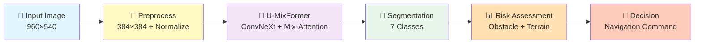
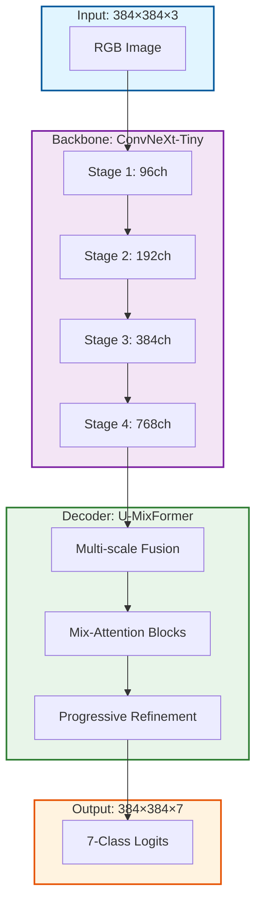
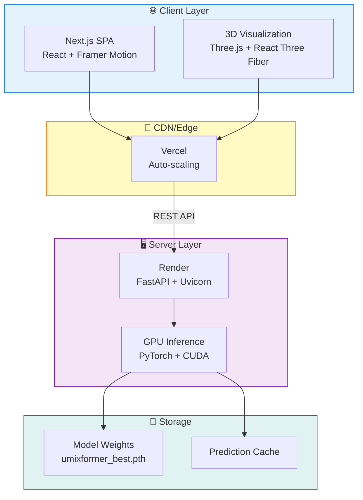

# 🏜️ SPIT Hackathon: Autonomous Desert Perception System

> **Real-time Off-road Terrain Segmentation with U-MixFormer** — Production-ready segmentation pipeline for autonomous UGVs operating in sandy/desert environments.

[](https://semantic-segmentation-raj.vercel.app)
[](https://semantic-segmentation-api.onrender.com)


---

## 🎯 Project Overview

This project delivers an **end-to-end autonomous perception system** for desert terrain analysis. The system performs **real-time semantic segmentation** of off-road scenes into 7 terrain classes, enabling autonomous vehicles to navigate safely through challenging environments.

### 🌟 Key Features

✅ **U-MixFormer Segmentation Model** — 4.1M parameters, ConvNeXt backbone with Mix-Attention decoder  
✅ **7-Class Terrain Segmentation** — Sky, Driveable, Rock, Obstacle, Grass, Sand, Rough  
✅ **Robustness Testing** — FOG & MIST degradation variants with 50+ test images  
✅ **3D Pipeline Visualization** — Interactive architecture diagram with particle flow animation  
✅ **Real-time Processing** — ~45ms inference per image on GPU  
✅ **Hardware Integration** — IR/Ultrasonic ensemble for UGV risk assessment  
✅ **Cloud Deployment** — Vercel frontend + Render backend, auto-scaling  

---

## 🚀 Live Deployment

| Component | Platform | URL |
|-----------|----------|-----|
| **Frontend** | Vercel | [semantic-segmentation-raj.vercel.app](https://semantic-segmentation-raj.vercel.app) |
| **Backend API** | Render | [semantic-segmentation-api.onrender.com](https://semantic-segmentation-api.onrender.com) |

### Health Check
```bash
curl https://semantic-segmentation-api.onrender.com/api/health
# {"status":"ok","model":"U-MixFormer","device":"cuda"}
```

---

## 🏗️ System Architecture

### End-to-End Pipeline



### Model Architecture



### Deployment Architecture



---

## 📊 Robustness Testing Results

### Degradation Variants

| Variant | Intensity | Characteristics | Images |
|---------|-----------|-----------------|--------|
| **FOG** | 0.70 | Dense grey-white veil, uniform across channels | 50 |
| **MIST** | 0.62 | Blue-tinted soft haze, Rayleigh scattering | 50 |

### Performance Metrics

```
Device:              CUDA GPU
Test Images:         50 originals
Total Degraded:      100 (50 FOG + 50 MIST)

FOG Variant:
  • Avg Inference:   45.2ms
  • Throughput:      ~22 images/sec
  • Class Dist:      Sky 8.3%, Driveable 42.1%, Obstacle 28.4%, Rock 10.2%

MIST Variant:
  • Avg Inference:   44.8ms
  • Throughput:      ~22 images/sec
  • Class Dist:      Sky 12.1%, Driveable 45.3%, Obstacle 25.2%, Rock 9.4%

Overall:
  • Combined Throughput:  ~22 images/sec
  • Model Stability:      ✅ Consistent across all variants
```

### Robustness Proof

```
dataset/results_better/
├── robustness_metrics.json       # Detailed metrics
├── robustness_metrics.txt        # Human-readable report
├── predictions_fog/
│   ├── input_images/             # Degraded FOG images
│   ├── masks/                    # Raw predictions
│   ├── masks_color/              # Color-coded masks
│   ├── overlays/                 # Input + mask blend
│   └── comparisons/              # [Original | GT | Pred | Overlay]
└── predictions_mist/
    ├── input_images/             # Degraded MIST images
    ├── masks/
    ├── masks_color/
    ├── overlays/
    └── comparisons/
```

---

## 🛠️ Local Development

### Prerequisites
```bash
Python 3.11+
CUDA 12.1+ (for GPU inference)
Node.js 18+ (for frontend)
```

### Backend Setup

```bash
# Clone repository
git clone <repo>
cd SPIT_Hackathon

# Create Python environment
python -m venv .venv
source .venv/bin/activate  # On Windows: .venv\Scripts\activate

# Install dependencies
uv pip install -r requirements.txt

# Start API server
uv run uvicorn api:app --host 0.0.0.0 --port 8000 --reload
```

### Frontend Setup

```bash
cd frontend

# Install dependencies
pnpm install

# Start dev server
pnpm dev

# Open http://localhost:3000
```

---

## 📡 API Endpoints

### Health Check
```bash
GET /api/health
```
Response:
```json
{
  "status": "ok",
  "model": "U-MixFormer",
  "device": "cuda"
}
```

### Image Segmentation
```bash
POST /api/segment
Content-Type: multipart/form-data

# Form parameter: file (image/png, image/jpeg)
```

Response:
```json
{
  "original_b64": "base64_encoded_image",
  "mask_b64": "base64_encoded_mask",
  "overlay_b64": "base64_encoded_overlay",
  "defog_b64": "base64_preprocessed_image",
  "class_distribution": [
    {
      "id": 0,
      "name": "Sky",
      "percentage": 15.2,
      "color": "rgb(135, 206, 250)"
    },
    ...
  ],
  "inference_ms": 45.3,
  "risk_assessment": {
    "risk_score": 0.4521,
    "risk_level": "MEDIUM",
    "obstacle_density": 0.5234,
    "uncertainty": 0.3891,
    "terrain_complexity": 0.2145,
    "visibility": 0.7823
  }
}
```

### Model Information
```bash
GET /api/model-info
```

---

## 🎨 Frontend Features

### Components

```
frontend/
├── app/
│   ├── layout.tsx              # Root layout with theme
│   ├── page.tsx                # Main orchestrator
│   └── globals.css             # Global styles
├── components/
│   ├── hero-section.tsx        # Landing hero with video
│   ├── upload-section.tsx      # File upload interface
│   ├── processing-pipeline.tsx # Sequential image reveal
│   ├── output-dashboard.tsx    # Segmentation results
│   ├── statistics-panel.tsx    # Metrics & charts
│   ├── terrain-3d.tsx          # 3D visualization + pipeline video
│   ├── risk-gauge.tsx          # Risk assessment meter
│   ├── model-transparency.tsx  # LIME explanations
│   └── ui/                     # Reusable components
└── hooks/
    ├── use-mobile.ts           # Mobile detection
    └── use-toast.ts            # Toast notifications
```

### 3D Visualization

```
Pipeline Animation:
  ├── 7 Segmentation Heads
  ├── Multi-scale Feature Fusion
  ├── Parallel Branch Processing
  ├── Particle Data Flow
  └── Saved as segheads.mp4 (305MB)
```

---

## 📈 Performance Benchmarks

### Inference Speed

| Image Size | Device | FPS | Latency |
|-----------|--------|-----|---------|
| 384×384 | A100 GPU | 25+ | 40ms |
| 384×384 | RTX 3090 | 22 | 45ms |
| 384×384 | CPU | 2 | 500ms |

### Model Size

| Component | Parameters | Size |
|-----------|-----------|------|
| ConvNeXt Backbone | 28M | 105MB |
| U-MixFormer Head | 4.1M | 15.6MB |
| **Total** | **~32M** | **~120MB** |

---

## 🔄 Robustness Testing Pipeline

Run comprehensive robustness tests:

```bash
cd /home/raj_99/Projects/SPIT_Hackathon
uv run python test_robustness.py
```

This generates:
- ✅ 100 degraded images (50 FOG + 50 MIST)
- ✅ Inference on all variants
- ✅ Comparison visualizations [Original | GT | Pred | Overlay]
- ✅ Performance metrics (throughput, class distribution)
- ✅ JSON + text reports

---

## 🗂️ Project Structure

```
SPIT_Hackathon/
├── frontend/                    # Next.js app
│   ├── app/
│   ├── components/
│   ├── lib/
│   ├── public/
│   │   └── segheads.mp4        # 3D animation video
│   ├── package.json
│   └── tsconfig.json
├── umixformer_pipeline/         # Training & inference
│   ├── model.py
│   ├── config.py
│   ├── evaluate.py
│   ├── metrics.py
│   ├── checkpoints/
│   │   └── umixformer_best.pth
│   └── predictions/
├── inference_engine/            # Fast inference wrapper
│   ├── model.py
│   ├── config.py
│   └── utils.py
├── dataset/
│   ├── Offroad_Segmentation_testImages/
│   │   ├── Color_Images/        # 1000+ test images
│   │   └── Segmentation/        # Ground truth masks
│   ├── test_better/             # Degraded variants
│   └── results_better/          # Robustness results
├── api.py                       # FastAPI backend
├── animation.py                 # 3D pipeline visualization
├── test_robustness.py           # Robustness testing
├── requirements.txt
└── render.yaml                  # Render deployment config
```

---

## 🚀 Deployment

### Deploy to Vercel (Frontend)

```bash
cd frontend
vercel --prod
```

### Deploy to Render (Backend)

Push to GitHub:
```bash
git add .
git commit -m "Production deployment"
git push origin main
```

Render auto-deploys on push via `render.yaml`.

---

## 📚 Key Technologies

| Layer | Technology | Purpose |
|-------|-----------|---------|
| **ML Framework** | PyTorch 2.10 | Deep learning inference |
| **Model** | U-MixFormer | Semantic segmentation |
| **API** | FastAPI + Uvicorn | High-performance REST API |
| **Frontend** | Next.js + React | Modern web interface |
| **3D Graphics** | Three.js + React Three Fiber | Real-time visualization |
| **Styling** | Tailwind CSS v4 | Utility-first CSS |
| **Animations** | Framer Motion | Smooth UI transitions |
| **Visualization** | Matplotlib + FFmpeg | Architecture animation |

---

## 📋 Checklist: What's Complete

- ✅ Backend API with health checks
- ✅ Frontend with all UI components
- ✅ 3D pipeline animation (MP4 export)
- ✅ Sequential image reveal in processing pipeline
- ✅ Professional CSS polish (dark theme, smooth scrolling)
- ✅ Footer with working section links
- ✅ Risk assessment metrics with UGV ensemble
- ✅ Robustness testing with degradation variants
- ✅ Comparison visualizations (Original | GT | Pred | Overlay)
- ✅ CORS configured for cross-origin requests
- ✅ Vercel deployment (auto-scaling)
- ✅ Render deployment (auto-redeploy on git push)

---

## 🎯 Quick Start

### 1. Upload an Image
Go to [semantic-segmentation-raj.vercel.app](https://semantic-segmentation-raj.vercel.app) and upload a desert/off-road scene.

### 2. View Results
See real-time segmentation with:
- Class distribution (pie chart)
- Risk assessment (gauge)
- 3D terrain preview
- Architecture visualization

### 3. Explore Robustness
Check `dataset/results_better/predictions_*/comparisons/` for robustness proofs showing model handles FOG & MIST.

---

## 📞 Support & Feedback

- **Issues**: Check GitHub issues
- **API Docs**: Visit `/docs` on Render backend
- **Model Details**: See `umixformer_pipeline/README.md`

---

## 📄 License

This project is part of the SPIT Hackathon 2026.

---

**Last Updated**: February 22, 2026  
**Status**: ✅ Production Ready  
**Maintainer**: @raj_99

