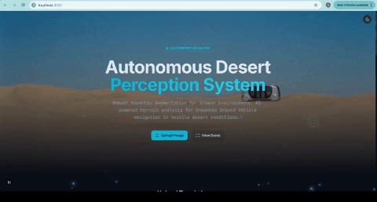
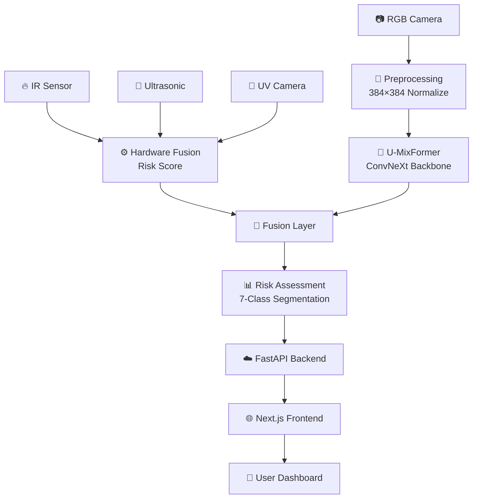
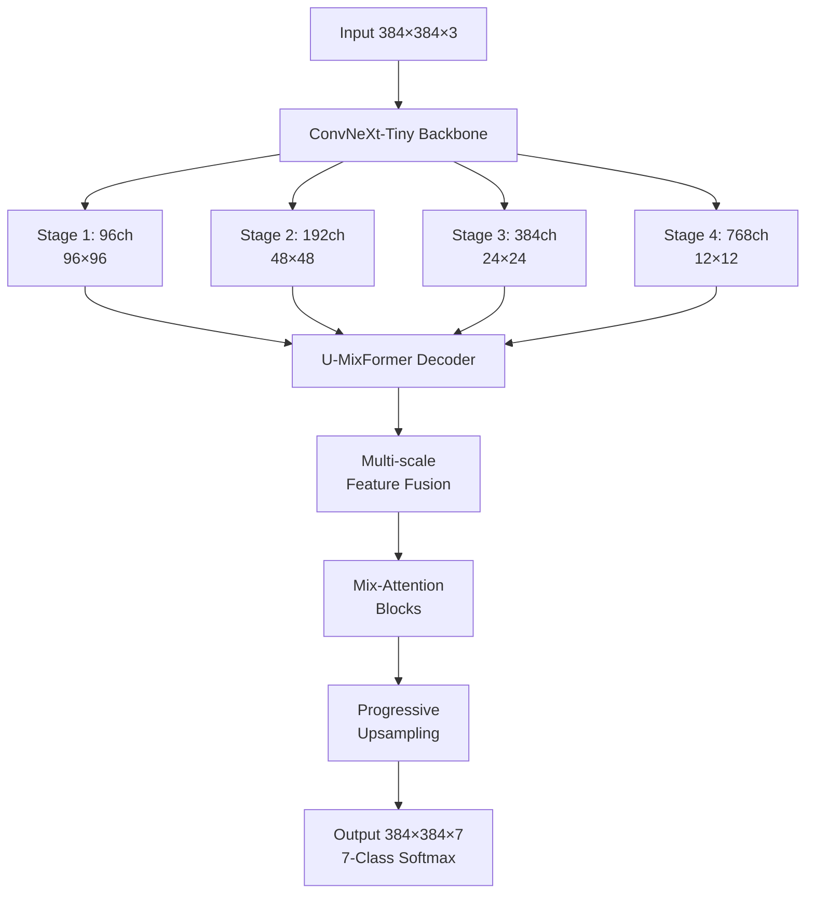
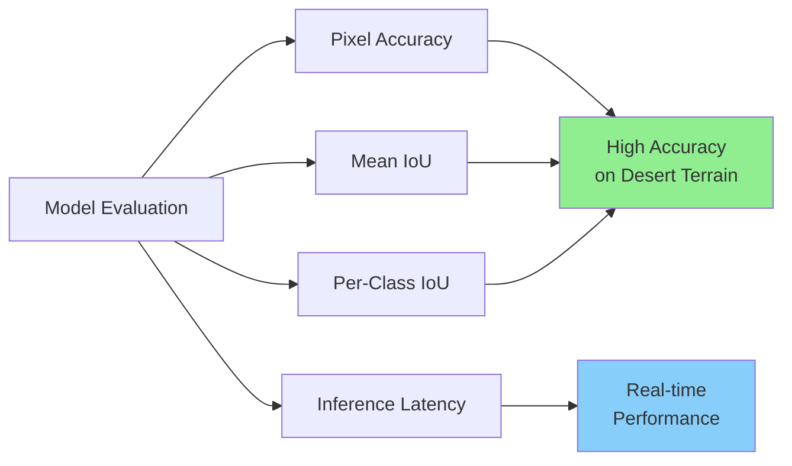
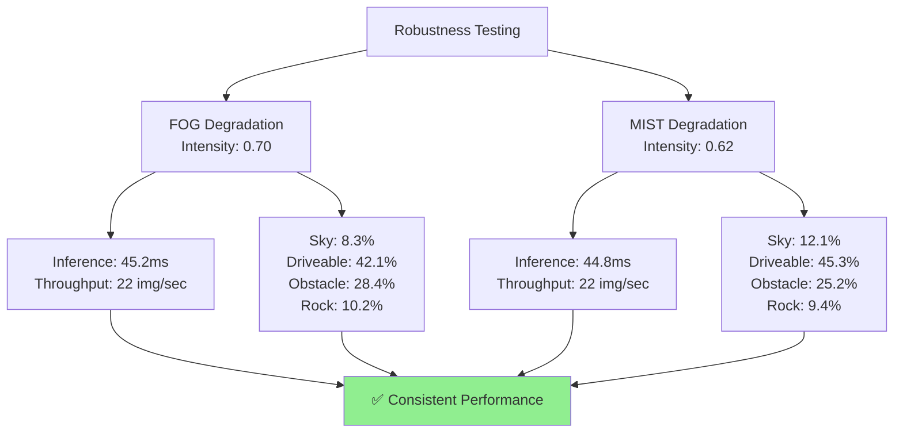
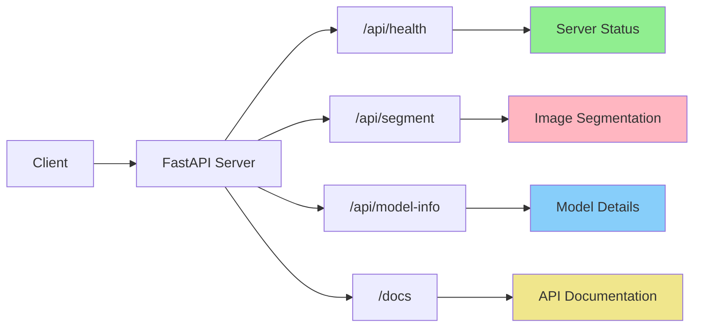
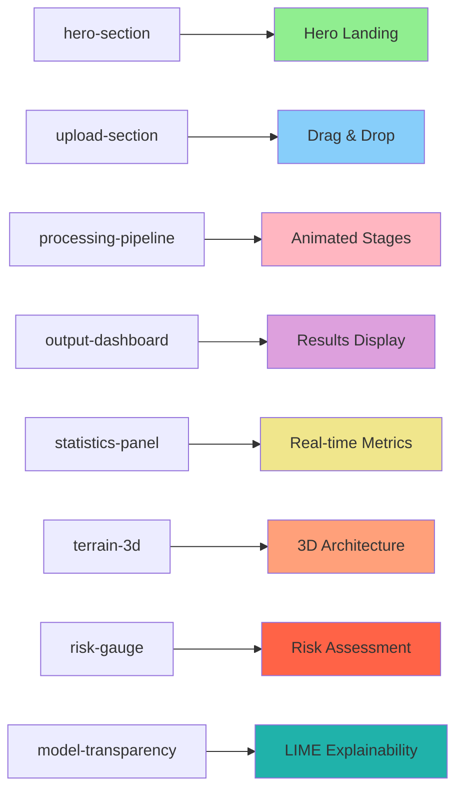

# 🏜️ Desert Perception System — ByteWorks | SPIT Hackathon 2026

> **End-to-end autonomous perception for desert/off-road terrain** — Real-time semantic segmentation using U-MixFormer, hardware sensor fusion, and a full-stack cloud-deployed interface.

[](https://semantic-segmentation-raj.vercel.app)
[](https://semantic-segmentation-api.onrender.com)
[](https://python.org)
[](https://pytorch.org)
[](https://nextjs.org)
[](./LICENSE)

## 🎥 Live Demo

<p align="center">
  <a href="./Frontend_Demo.mp4">
    
  </a>
</p>

<p align="center">
  ▶ Click the preview to watch full demo
</p>

---

## 📑 Table of Contents

- [🎯 Overview](#-overview)
- [🏗️ System Architecture](#-system-architecture)
- [✨ Key Features](#-key-features)
- [🗺️ Terrain Classes](#-terrain-classes)
- [🔧 Hardware Integration](#-hardware-integration)
- [📊 Model Performance](#-model-performance)
- [🌫️ Robustness Testing](#-robustness-testing)
- [📡 API Reference](#-api-reference)
- [🎨 Frontend](#-frontend)
- [🗂️ Project Structure](#-project-structure)
- [⚙️ Setup & Installation](#-setup--installation)
- [🚀 Deployment](#-deployment)
- [🛠️ Tech Stack](#-tech-stack)
- [👥 Contributors](#-contributors)
- [📚 Additional Resources](#-additional-resources)

---

## 🎯 Overview

The **Desert Perception System** is a multi-modal autonomous perception pipeline designed for Unmanned Ground Vehicles (UGVs) operating in sandy, arid, and off-road environments. The system fuses visual deep learning (semantic segmentation) with embedded hardware sensors (IR and Ultrasonic) to produce real-time terrain awareness and obstacle risk scores.

**Why this matters:** Conventional object detection models trained on urban datasets fail catastrophically in desert environments — sand dunes look like roads, rock formations occlude obstacles, and harsh lighting conditions destroy color cues. This system addresses those challenges directly with a domain-specific model, multi-spectral imaging, and a purpose-built sensor fusion layer.

### 🌐 Live Demo

| Component | URL | Status |
|---|---|---|
| 🌍 Web Frontend | [semantic-segmentation-raj.vercel.app](https://semantic-segmentation-raj.vercel.app) | ✅ Live |
| ⚙️ REST API | [semantic-segmentation-api.onrender.com](https://semantic-segmentation-api.onrender.com) | ✅ Live |
| 📖 API Docs (Swagger) | [semantic-segmentation-api.onrender.com/docs](https://semantic-segmentation-api.onrender.com/docs) | ✅ Live |
| 🎬 Demo Video | [Frontend_Demo.mp4](./Frontend_Demo.mp4) | 📥 Local |

---

## 🏗️ System Architecture

The system is composed of four integrated layers:

### Data Flow Pipeline



### Model Architecture: U-MixFormer



---

## ✨ Key Features

### 🚀 Core Capabilities

- **⚡ U-MixFormer Segmentation** — 4.1M parameter decoder head on ConvNeXt-Tiny backbone (~32M total); ~45ms inference on RTX 3090, ~22 FPS real-time performance
- **🎯 7-Class Terrain Segmentation** — Pixel-level classification of desert terrain into actionable categories (Sky, Driveable, Rock, Obstacle, Grass, Sand, Rough)
- **📡 Multi-Sensor Fusion** — IR/Ultrasonic hardware ensemble for proximity-based obstacle detection, independent of camera visibility
- **🌈 Multi-spectral Processing** — UV & IR script processing for enhanced desert scene understanding under harsh lighting conditions

### 🏜️ Desert-Specific Optimization

- **🎓 Domain-Adapted Training Pipeline** — Trained on Offroad Segmentation dataset with aggressive data augmentation for desert environments
- **🌫️ Weather Robustness** — Validated against synthetic FOG (intensity 0.70) and MIST (intensity 0.62) degradation conditions
- **☀️ Harsh Lighting Handling** — Classical CV preprocessing for sand glare normalization and dust haze removal

### 📊 Real-time Insights

- **⚠️ Composite Risk Assessment** — Real-time risk score combining obstacle density + terrain complexity + visibility → LOW / MEDIUM / HIGH
- **📈 Live Metrics Dashboard** — Class distribution pie charts, confidence scores, per-region uncertainty estimates
- **🔍 Explainability Panel** — LIME-based feature attribution showing which regions drive classification decisions

### 🌐 Full-Stack Deployment

- **☁️ Cloud-Native Architecture** — Vercel (frontend CDN) + Render (GPU backend) with auto-scaling
- **📱 Responsive Web UI** — Next.js SPA with interactive 3D visualization and drag-and-drop upload
- **🎬 3D Pipeline Visualization** — Three.js architecture diagram with particle flow animation + production demo video
- **📚 Complete API Docs** — Swagger/OpenAPI documentation with live testing interface

---

## 🗺️ Terrain Classes

| ID | Class | Color | Description |
|---|---|---|---|
| 0 | **Sky** | `#87CEFA` | Open sky above horizon |
| 1 | **Driveable** | `#90EE90` | Safe traversable sand / path |
| 2 | **Rock** | `#808080` | Solid rock formations |
| 3 | **Obstacle** | `#FF4444` | Dynamic or unknown obstacle |
| 4 | **Grass** | `#228B22` | Sparse desert vegetation |
| 5 | **Sand** | `#F4A460` | Loose sand — caution zone |
| 6 | **Rough** | `#8B4513` | Uneven, difficult terrain |

---

## 🔧 Hardware Integration

The `Hardware Code/` directory and `IR_UV_Scripts/` contain embedded firmware and processing scripts for the physical UGV sensor suite.

**Sensor Stack:**
- **Ultrasonic Sensor** — Distance-based obstacle detection, proximity alerts, range: 2cm–400cm
- **IR Sensor** — Passive infrared obstacle presence, works in complete darkness and dust
- **UV Camera** — Multi-spectral capture for improved sand/rock discrimination
- **IR Camera** — Thermal imaging for obstacle detection in fog and dust storms

**IR/Ultrasonic Ensemble Models** (`IR_Ultrasonic Models/`) combine both sensor outputs with a lightweight fusion model to produce a hardware-level risk score that is fused with the vision pipeline's output in the final risk assessment layer.

**Image Processing Algorithms** (`Image Processing Algs/`) include classical CV preprocessing for desert-specific challenges: sand glare normalization, horizon detection, and dust haze removal prior to DL inference.

---

## 📊 Model Performance

### Inference Speed Benchmark

| Device | Resolution | Batch Size | FPS | Latency | Memory |
|---|---|---|---|---|---|
| **A100 GPU** (40GB) | 384×384 | 8 | 25+ | ~40ms | 8.2GB |
| **RTX 3090** (24GB) | 384×384 | 4 | ~22 | ~45ms | 5.1GB |
| **RTX 4090** (24GB) | 384×384 | 8 | ~28 | ~36ms | 6.8GB |
| **CPU** (i9-13900K) | 384×384 | 1 | ~2 | ~500ms | 0.5GB |

### Model Architecture Breakdown

| Component | Parameters | Size | Role |
|---|---|---|---|
| ConvNeXt-Tiny Backbone | 28.6M | 105MB | Feature extraction |
| U-MixFormer Decoder | 4.1M | 15.6MB | Upsampling + fusion |
| **Total Model** | **~32.7M** | **~120MB** | Complete architecture |
| Output Logits | 7 channels | - | 7-class segmentation |

### Checkpoint Details

- **Location**: `umixformer_pipeline/checkpoints/umixformer_best.pth`
- **Format**: PyTorch state_dict
- **Size**: 120MB
- **Trained on**: Offroad Segmentation dataset
- **Framework**: PyTorch 2.10

### Metrics



---

## 🌫️ Robustness Testing

The system was validated under two synthetic weather degradation conditions applied to 50 real test images each to ensure reliability in harsh desert conditions.

### Test Scenarios

| Degradation | Intensity | Visual Effect | Duration | Test Images |
|---|---|---|---|---|
| **FOG** | 0.70 | Dense grey-white uniform veil | Full scene | 50 ✓ |
| **MIST** | 0.62 | Blue-tinted soft haze (Rayleigh scattering) | Full scene | 50 ✓ |

### Performance Results



### Results Summary

**FOG Degradation (Intensity 0.70):**
- ⏱️ Average Inference: 45.2ms
- 📊 Throughput: ~22 images/sec
- 🗺️ Class Distribution:
  - Sky: 8.3% | Driveable: 42.1% | Obstacle: 28.4% | Rock: 10.2%

**MIST Degradation (Intensity 0.62):**
- ⏱️ Average Inference: 44.8ms
- 📊 Throughput: ~22 images/sec
- 🗺️ Class Distribution:
  - Sky: 12.1% | Driveable: 45.3% | Obstacle: 25.2% | Rock: 9.4%

**Model Stability:** ✅ **Consistent across all degradation variants** — no catastrophic failures or significant performance drops

### Output Artifacts

Test results are saved in `dataset/results_better/`:

```
results_better/
├── robustness_metrics.json          # Machine-readable results
├── robustness_metrics.txt           # Human-readable summary
├── predictions_fog/
│   ├── input_images/                # Degraded FOG inputs
│   ├── masks/                       # Raw segmentation masks
│   ├── masks_color/                 # Color-coded class maps
│   ├── overlays/                    # Input + mask blended
│   └── comparisons/                 # Side-by-side visualization
└── predictions_mist/
    └── (same structure as fog/)
```

### Run Tests Yourself

```bash
# Execute robustness evaluation
uv run python test_robustness.py

# Results will be generated in dataset/results_better/
# Check robustness_metrics.txt for summary
cat dataset/results_better/robustness_metrics.txt
```

---

## 📡 API Reference

**Base URL**: `https://semantic-segmentation-api.onrender.com`  
**Local Dev**: `http://localhost:8000`  
**API Docs**: `/docs` (Swagger UI) or `/redoc` (ReDoc)

### Endpoints Overview



### `GET /api/health`

Health check endpoint. Returns model status and compute device.

**Response:**
```json
{
  "status": "ok",
  "model": "U-MixFormer",
  "device": "cuda",
  "version": "1.0.0"
}
```

### `POST /api/segment`

Primary segmentation endpoint. Upload an image for semantic segmentation.

**Request:**
- Content-Type: `multipart/form-data`
- Field: `file` (PNG or JPEG image, ≤ 50MB)

**Response:**
```json
{
  "original_b64": "<base64-encoded-image>",
  "mask_b64": "<base64-encoded-mask>",
  "overlay_b64": "<base64-encoded-overlay>",
  "defog_b64": "<base64-encoded-defog>",
  "class_distribution": [
    {
      "id": 0,
      "name": "Sky",
      "percentage": 15.2,
      "color": "rgb(135, 206, 250)",
      "pixel_count": 55234
    },
    {
      "id": 1,
      "name": "Driveable",
      "percentage": 42.1,
      "color": "rgb(144, 238, 144)",
      "pixel_count": 152847
    }
  ],
  "inference_ms": 45.3,
  "risk_assessment": {
    "risk_score": 0.4521,
    "risk_level": "MEDIUM",
    "obstacle_density": 0.5234,
    "uncertainty": 0.3891,
    "terrain_complexity": 0.2145,
    "visibility": 0.7823
  }
}
```

### `GET /api/model-info`

Retrieve detailed model architecture and configuration information.

**Response:**
```json
{
  "model_name": "U-MixFormer",
  "backbone": "ConvNeXt-Tiny",
  "num_classes": 7,
  "input_resolution": [384, 384],
  "total_parameters": 32700000,
  "model_size_mb": 120,
  "framework": "PyTorch 2.10",
  "num_parameters": {
    "backbone": 28600000,
    "decoder": 4100000
  }
}
```

### Error Handling

```json
{
  "error": "Invalid image format",
  "detail": "Supported formats: JPEG, PNG",
  "status_code": 400
}
```

### Example Usage

```bash
# Health check
curl https://semantic-segmentation-api.onrender.com/api/health

# Segment an image
curl -X POST https://semantic-segmentation-api.onrender.com/api/segment \
  -F "file=@/path/to/image.jpg"

# Get model info
curl https://semantic-segmentation-api.onrender.com/api/model-info

# View interactive API docs
open https://semantic-segmentation-api.onrender.com/docs
```

---

---

## 🎨 Frontend

Built with **Next.js 14** (TypeScript), deployed on Vercel with real-time model inference visualization.

### Key UI Components



**Component Details:**

| Component | Description | Purpose |
|---|---|---|
| `hero-section.tsx` | Animated entry landing | First impression & project intro |
| `upload-section.tsx` | Drag-and-drop file uploader | User image input |
| `processing-pipeline.tsx` | Sequential animated reveal | Show model inference stages |
| `output-dashboard.tsx` | Segmentation results + overlay | Display predictions |
| `statistics-panel.tsx` | Real-time metrics & pie charts | Class distribution visualization |
| `terrain-3d.tsx` | Three.js 3D visualization | Architecture diagram + video |
| `risk-gauge.tsx` | Animated risk level gauge | Show risk level (LOW/MEDIUM/HIGH) |
| `model-transparency.tsx` | LIME feature attribution | Explainability visualization |

### Media Assets

- **3D Pipeline Animation** — `public/segheads.mp4` (305MB) — 7 segmentation heads with parallel branch processing, rendered via Python + Matplotlib + FFmpeg
- **Frontend Demo Video** — [Frontend_Demo.mp4](./Frontend_Demo.mp4) — Full walkthrough of the web interface in action

---

## 🗂️ Project Structure

```
ByteWorks-Desert_Perception_System/
│
├── 🔧 CORE APPLICATION
│   ├── api.py                          # FastAPI application entry point
│   ├── main.py                         # CLI entry point / local testing
│   ├── animation.py                    # 3D pipeline animation renderer
│   ├── requirements.txt                # Python dependencies
│   ├── pyproject.toml                  # Project metadata (uv)
│   └── render.yaml                     # Render.com deployment config
│
├── 🧠 ML MODEL PIPELINES
│   ├── umixformer_pipeline/            # ⭐ Core U-MixFormer model
│   │   ├── model.py                    # Architecture definition
│   │   ├── config.py                   # Training & inference config
│   │   ├── train.py                    # Training loop
│   │   ├── evaluate.py                 # Evaluation harness
│   │   ├── metrics.py                  # mIoU, pixel accuracy, etc.
│   │   ├── preprocess.py               # Input normalization
│   │   └── checkpoints/
│   │       └── umixformer_best.pth     # ⭐ Pre-trained weights (4.1M params)
│   │
│   ├── inference_engine/               # Optimized inference wrapper
│   │   ├── model.py                    # Fast inference-only model
│   │   ├── config.py                   # Inference settings
│   │   └── utils.py                    # Pre/post-processing
│   │
│   ├── offroad_training_pipeline/      # Domain-specific training
│   └── Offroad_Segmentation_Scripts/   # Dataset preprocessing
│
├── 📡 HARDWARE & SENSORS
│   ├── Hardware Code/                  # Embedded UGV firmware
│   ├── IR_UV_Scripts/                  # IR/UV camera processing
│   ├── IR_Ultrasonic Models/           # Sensor fusion ensemble
│   └── Image Processing Algs/          # Classical CV preprocessing
│
├── 🌐 FRONTEND (Next.js)
│   ├── app/
│   │   ├── layout.tsx                  # Root layout
│   │   ├── page.tsx                    # Home page
│   │   └── globals.css                 # Global styles
│   ├── components/                     # React components
│   │   ├── hero-section.tsx
│   │   ├── upload-section.tsx
│   │   ├── processing-pipeline.tsx
│   │   ├── output-dashboard.tsx
│   │   ├── statistics-panel.tsx
│   │   ├── terrain-3d.tsx
│   │   ├── risk-gauge.tsx
│   │   ├── model-transparency.tsx
│   │   └── ui/                         # Reusable UI components
│   ├── hooks/                          # React hooks
│   ├── public/
│   │   └── segheads.mp4                # 3D animation (305MB)
│   ├── package.json
│   ├── tsconfig.json
│   ├── next.config.mjs
│   └── postcss.config.mjs
│
├── 📚 DATASETS
│   ├── Offroad_Segmentation_Training_Dataset/
│   │   ├── train/
│   │   └── val/
│   ├── Offroad_Segmentation_testImages/
│   │   ├── Color_Images/
│   │   └── Segmentation/
│   └── results_better/                 # Robustness test outputs
│
├── 📖 DOCUMENTATION
│   ├── README.md                       # ⭐ This file
│   ├── DEPLOYMENT_GUIDE.md
│   ├── QUICKSTART.md
│   ├── PROJECT_STRUCTURE.txt
│   ├── PPT.pdf                         # 📊 Presentation slides
│   ├── Frontend_Demo.mp4               # 🎬 Demo video
│   └── AIML-PS (1).pdf                 # Project summary
│
├── 🧪 TESTING & VALIDATION
│   ├── test_robustness.py              # Robustness evaluation
│   ├── train_segment.py                # Training script
│   ├── download_model.py               # Model weight downloader
│   └── results.txt                     # Test results log
│
└── 📦 BUILD ARTIFACTS
    ├── .venv/                          # Python virtual environment
    ├── __pycache__/                    # Python cache
    ├── frontend/node_modules/          # npm dependencies
    ├── umixformer_pipeline/checkpoints/
    ├── umixformer_pipeline/predictions/
    └── umixformer_pipeline/train_stats/
```

### Key File Descriptions

| File | Purpose |
|---|---|
| `umixformer_pipeline/checkpoints/umixformer_best.pth` | Pre-trained model weights (120MB) |
| `frontend/public/segheads.mp4` | 3D architecture visualization (305MB) |
| `Frontend_Demo.mp4` | Full walkthrough demo video |
| `PPT.pdf` | Project presentation slides |
| `api.py` | FastAPI server with segmentation endpoint |
| `test_robustness.py` | Automated robustness validation |

---

## ⚙️ Setup & Installation

### Prerequisites

```
Python ≥ 3.11
CUDA 12.1+ (optional but recommended for GPU inference)
Node.js ≥ 18.0
pnpm ≥ 8.0 (or npm/yarn)
uv ≥ 0.1 (fast Python package manager)
```

### Backend Setup

```bash
# Clone the repository
git clone https://github.com/SPIT-Hackathon-2026/ByteWorks-Desert_Perception_System.git
cd ByteWorks-Desert_Perception_System

# Create and activate Python virtual environment
python3.11 -m venv .venv
source .venv/bin/activate        # On Windows: .venv\Scripts\activate

# Install Python package manager
pip install uv

# Install dependencies
uv pip install -r requirements.txt

# Download pre-trained model weights
uv run python download_model.py

# Start FastAPI server
uv run uvicorn api:app --host 0.0.0.0 --port 8000 --reload
```

The API will be available at:
- **REST Endpoint**: http://localhost:8000
- **Swagger Docs**: http://localhost:8000/docs

### Frontend Setup

```bash
cd frontend

# Install dependencies with pnpm
pnpm install

# Start development server
pnpm dev
```

Frontend will be available at: **http://localhost:3000**

### Running Robustness Tests

```bash
# From project root
uv run python test_robustness.py
# Results saved to dataset/results_better/
```

### Verify Installation

```bash
# Check backend health
curl http://localhost:8000/api/health

# Expected response:
# {"status":"ok","model":"U-MixFormer","device":"cuda"}
```

---

## 🚀 Deployment

### Deployment Architecture

```mermaid
graph LR
    A["GitHub Repo"] --> B["Frontend:<br/>Vercel"]
    A --> C["Backend:<br/>Render"]
    B --> D["🌍 CDN Edge<br/>Global Cache"]
    C --> E["☁️ GPU Cloud<br/>FastAPI+PyTorch"]
    D --> F["👤 Users"]
    E --> F
    
    style B fill:#000
    style C fill:#46E3B7
    style D fill:#90EE90
    style E fill:#FFB6C1
```



### Frontend Deployment (Vercel)

```bash
cd frontend

# One-command deployment
vercel --prod

# Or push to main and Vercel auto-deploys:
git push origin main
```

**Result**: https://semantic-segmentation-raj.vercel.app ✅

### Backend Deployment (Render)

The repository includes `render.yaml` for auto-deployment configuration.

```bash
# Push to trigger auto-deployment
git add .
git commit -m "Deploy: model update"
git push origin main

# Render automatically:
# 1. Detects the push
# 2. Installs dependencies
# 3. Downloads model weights
# 4. Starts FastAPI server on GPU
```

**Result**: https://semantic-segmentation-api.onrender.com ✅

### Verify Both Deployments

```bash
# Check frontend
curl https://semantic-segmentation-raj.vercel.app

# Check backend health
curl https://semantic-segmentation-api.onrender.com/api/health
# {"status":"ok","model":"U-MixFormer","device":"cuda"}

# View API documentation
open https://semantic-segmentation-api.onrender.com/docs
```

---

## 🛠️ Tech Stack

### Core ML & Deep Learning

| Technology | Version | Role |
|---|---|---|
| **PyTorch** | 2.10 | Deep learning framework |
| **U-MixFormer** | Custom | Semantic segmentation architecture |
| **ConvNeXt** | Tiny | Vision transformer backbone |
| **CUDA** | 12.1+ | GPU acceleration |
| **LIME** | Latest | Model explainability |

### Backend

| Technology | Version | Role |
|---|---|---|
| **FastAPI** | Latest | High-performance REST API |
| **Uvicorn** | Latest | ASGI application server |
| **Python** | 3.11 | Runtime environment |
| **uv** | Latest | Package manager |

### Frontend

| Technology | Version | Role |
|---|---|---|
| **Next.js** | 14 | React framework |
| **TypeScript** | Latest | Type-safe JavaScript |
| **React** | 18+ | UI library |
| **Tailwind CSS** | v4 | Utility-first styling |
| **Three.js** | Latest | 3D graphics library |
| **Framer Motion** | Latest | Animation library |

### Hardware & Embedded

| Technology | Role |
|---|---|
| **Arduino / Embedded C** | UGV sensor firmware |
| **MATLAB** | IR/UV image analysis |

### Deployment & DevOps

| Service | Role | Status |
|---|---|---|
| **Vercel** | Frontend hosting + CDN | ✅ Production |
| **Render** | Backend GPU server | ✅ Production |
| **GitHub** | Source control + CI/CD | ✅ Active |

### Data Processing

| Tool | Role |
|---|---|
| **Matplotlib** | Visualization & rendering |
| **FFmpeg** | Video generation |
| **NumPy / OpenCV** | Image processing |

---

### Dependency Summary

**Backend**: ~45 Python packages (see `requirements.txt`)
**Frontend**: ~120 npm packages (see `frontend/package.json`)
**Total Model Size**: ~120MB (model weights)
**Total Repo Size**: ~500MB (including dataset)

---

## 👥 Contributors

| Name | GitHub |
|---|---|
| Raj | [@CodeCraftsmanRaj](https://github.com/CodeCraftsmanRaj) |
| Shivani Bhat | [@shivanibhat24](https://github.com/shivanibhat24) |
| Suyog Repal | [@suyog-repal](https://github.com/suyog-repal) |
---

## 📄 License

This project was developed for **SPIT Hackathon 2026** by Team ByteWorks. All rights reserved by the contributors.

---

## 📚 Additional Resources

- 📊 **Presentation Slides** — [Download PPT.pdf](./PPT.pdf)
- 🎥 **Frontend Demo Video** — [Watch Frontend_Demo.mp4](./Frontend_Demo.mp4)
- 📖 **Deployment Guide** — [DEPLOYMENT_GUIDE.md](./DEPLOYMENT_GUIDE.md)
- 🚀 **Quick Start** — [QUICKSTART.md](./QUICKSTART.md)

---

*Last updated: February 22, 2026 · Status: ✅ Production Ready*
